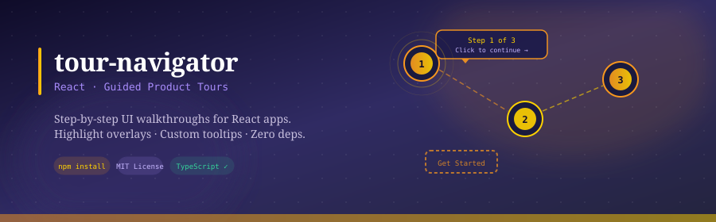

<div align="center">
  
</div>

<br/>

<div align="center">

[](https://www.npmjs.com/package/tour-navigator)
[](https://www.npmjs.com/package/tour-navigator)
[](LICENSE)
[](https://www.typescriptlang.org/)

**Customizable guided product tours for React.**  
Highlight overlays · Custom tooltips · Scroll-aware · Mutation observer support · Zero layout dependencies.

</div>

---

## About

Tour Navigator is a React component for building step-by-step UI walkthroughs. It renders a spotlight mask over target elements, positions a helper tooltip beside them, and handles scrolling, resizing, and DOM changes automatically. Every visual aspect — the overlay, mask, and helper — is fully customizable through render props.

- **Live Demo** — [leafy-malasada-f02c9a.netlify.app](https://leafy-malasada-f02c9a.netlify.app/)
- **CodeSandbox** — [Interactive example](https://codesandbox.io/p/sandbox/tour-navigator-9hvm54?file=%2Fsrc%2Findex.tsx)

---

## Installation

```bash
npm install tour-navigator
# or
yarn add tour-navigator
```

---

## Quick Start

```tsx
import TourNavigator from 'tour-navigator';
import { Align, Position } from 'tour-navigator/lib/TourNavigator/types';

const steps = [
  {
    selector: '.feature-button',
    data: { title: 'New Feature', body: 'Click here to get started.' },
    position: Position.BOTTOM,
    align: Align.CENTER,
  },
  {
    selector: '.settings-icon',
    data: { title: 'Settings', body: 'Customize your experience here.' },
    position: Position.LEFT,
    align: Align.START,
  },
];

<TourNavigator
  id="onboarding"
  steps={steps}
  helper={({ currentStep, next, prev, onRequestClose }) => (
    <div className="tooltip">
      <h4>{currentStep?.data.title}</h4>
      <p>{currentStep?.data.body}</p>
      <button onClick={prev}>Back</button>
      <button onClick={next}>Next</button>
    </div>
  )}
  onRequestClose={({ isMask }) => isMask && closeTour()}
/>
```

---

## Props

### Core

| Prop | Type | Default | Description |
|------|------|---------|-------------|
| `id` | `string` | `___tournavigator-${Date.now()}` | Unique identifier for the tour instance. |
| `steps` | `Step[]` | `[]` | Array of steps defining the tour sequence. |
| `isOpen` | `boolean` | `true` | Controls whether the tour is visible. |
| `startAt` | `number` | `0` | Index of the step to start the tour from. |
| `scrollBehavior` | `'smooth' \| 'auto'` | `'auto'` | Scroll behavior when moving between steps. |

### Mask

| Prop | Type | Default | Description |
|------|------|---------|-------------|
| `maskRadius` | `number` | `5` | Border radius of the highlight mask. |
| `maskPadding` | `number` | `5` | Padding between the target element and the mask edge. |
| `maskOpacity` | `number` | `1` | Opacity of the mask cutout. |
| `maskStyle` | `CSSProperties` | — | Custom styles applied to the mask. |
| `maskStyleDuringScroll` | `CSSProperties` | — | Custom styles applied to the mask while scrolling. |
| `maskHelperDistance` | `number` | `10` | Gap between the mask edge and the helper tooltip. |

### Overlay

| Prop | Type | Default | Description |
|------|------|---------|-------------|
| `overlayFill` | `string` | `'black'` | Fill color of the background overlay. |
| `overlayOpacity` | `number` | `0.5` | Opacity of the background overlay. |
| `overlay` | `(props: OverlayProps) => ReactNode` | `null` | Custom overlay component. Replaces the default overlay entirely. |
| `renderOverlay` | `boolean` | `true` | Set to `false` to disable the overlay entirely. |
| `screenHelperDistance` | `number` | `10` | Minimum distance between the helper and the screen edge. |

### Helper

| Prop | Type | Default | Description |
|------|------|---------|-------------|
| `helper` | `(props: HelperProps) => ReactNode` | `null` | Render prop for the tooltip/helper shown at each step. Receives full tour state and navigation controls. |
| `renderHelper` | `boolean` | `true` | Set to `false` to disable the helper entirely. |

### Callbacks

| Prop | Type | Default | Description |
|------|------|---------|-------------|
| `onAfterOpen` | `() => void` | `null` | Fired after the tour opens. |
| `onBeforeClose` | `() => void` | `null` | Fired before the tour closes. |
| `onRequestClose` | `(params: { event: MouseEvent \| PointerEvent, isMask: boolean, isOverlay: boolean }) => void` | `null` | Fired when the user clicks the mask or overlay. Use this to close the tour. |
| `onNext` | `(props: HelperProps) => void` | `null` | Fired when the tour advances to the next step. |
| `onPrev` | `(props: HelperProps) => void` | `null` | Fired when the tour goes back a step. |
| `onMove` | `(props: HelperProps) => void` | `null` | Fired on any step change (next or prev). |

### DOM & Rendering

| Prop | Type | Default | Description |
|------|------|---------|-------------|
| `renderElement` | `HTMLElement \| string` | — | The DOM element or CSS selector to render the tour into. Defaults to `document.body`. |
| `scrollingElement` | `HTMLElement \| Document \| Element \| string` | — | The element responsible for scrolling. Defaults to `document`. |
| `resizeListener` | `boolean` | `true` | Recalculates mask position on window resize. |
| `scrollListener` | `boolean` | `true` | Recalculates mask position on scroll. |
| `mutationObserve` | `MutationObserverConfig` | — | Watch for DOM changes and update the tour accordingly. |
| `waitForElementRendered` | `boolean` | — | When `mutationObserve` is set, waits for the target element to appear in the DOM before advancing. |
| `className` | `string` | — | CSS class added to the root tour container. |
| `style` | `CSSProperties` | — | Inline styles for the root tour container. |

---

## Step

```typescript
type Step = {
  selector: string;                    // CSS selector for the target element
  data: any;                           // Arbitrary data passed to the helper render prop
  position?: Position | [Position, Position, Position, Position];
  align?: Align;
  scrollIntoView?: boolean;            // Default: true
  intersectionOption?: IntersectionOption | ((opt: IntersectionOption) => IntersectionOption);
}

type IntersectionOption = {
  root?: Element | Document | string | null;  // Default: null
  rootMargin?: string;                        // Default: dynamically adjusted
  threshold?: number;                         // Default: dynamically adjusted
}
```

### Position & Align

```typescript
import { Position, Align } from 'tour-navigator/lib/TourNavigator/types';

// Position — where the helper appears relative to the target
Position.TOP | Position.BOTTOM | Position.LEFT | Position.RIGHT

// Align — alignment of the helper along that axis
Align.START | Align.CENTER | Align.END
```

You can pass a 4-tuple to `position` as a priority order — Tour Navigator will use the first one that fits on screen:

```tsx
position={[Position.BOTTOM, Position.RIGHT, Position.TOP, Position.LEFT]}
```

---

## HelperProps

The `helper` render prop receives the following object:

```typescript
type HelperProps = {
  id: string;
  currentStep: Step | null;
  target: HTMLElement | null;
  currentStepIndex: number;
  previousStepIndex: number;
  steps: Step[];
  isScrollingIntoView: boolean;

  focus: (scrollBehavior?: 'auto' | 'smooth') => void;   // Re-focus the current target
  goto: (stepIndex: number) => void;                      // Jump to any step
  next: () => void;                                       // Advance one step
  prev: () => void;                                       // Go back one step
  onRequestClose: ((params: {
    event: MouseEvent | PointerEvent;
    isMask: boolean;
    isOverlay: boolean;
  }) => void) | null;
}
```

---

## Ref

`TourNavigator` is a class component — you can attach a `ref` for imperative control:

```tsx
import { createRef } from 'react';

const tourRef = createRef<TourNavigator>();

// Imperative API
tourRef.current?.next();
tourRef.current?.prev();
tourRef.current?.goto(2);
tourRef.current?.focus('smooth');

<TourNavigator ref={tourRef} id="my-tour" steps={steps} />
```

---

## Multi-Route Tours

Need a tour that spans multiple pages? See [`multiroute-tour-navigator`](https://www.npmjs.com/package/multiroute-tour-navigator) — a companion package that extends Tour Navigator with React Router support and persistent step state across route changes.

---

## License

MIT © [Vivek Sharma](https://github.com/viveKing21)
